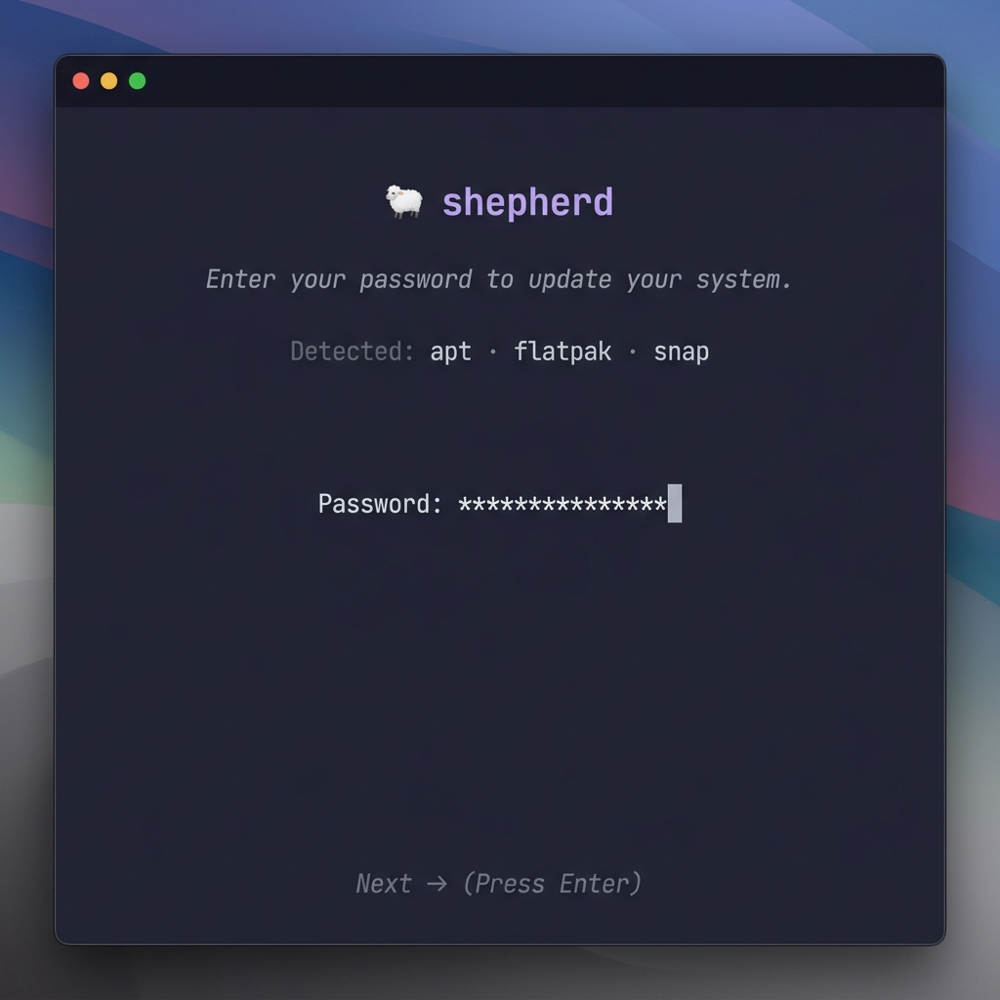

<div align="center">

<br>

```
     ,@@@.
    ( o.o )
     /|  |\
      d  b
```

# shepherd

**The universal Linux package manager updater.**

One command. One password. Every package manager updated.

<br>

[](https://github.com/jstreitb/shepherd/releases)
[](LICENSE)
[](https://go.dev)
[](https://github.com/jstreitb/shepherd/stargazers)

<br>



<br>

</div>

---

## Quick Install

```bash
curl -sSfL https://raw.githubusercontent.com/jstreitb/shepherd/main/install.sh | bash
```

> **Security Note:** You can verify the installer script before running it by downloading it first, reading it, or checking its checksum against the release assets.

To update Shepherd itself to the latest version, simply run:
```bash
shepherd --update
```

Or build from source:

```bash
git clone https://github.com/jstreitb/shepherd.git
cd shepherd && make build
sudo mv shepherd /usr/local/bin/
```

## How It Works

```
$ shepherd
```

1. **Detects** installed package managers automatically
2. **Asks** for your sudo password once (masked, secure)
3. **Updates** everything sequentially with a live animated TUI
4. **Shows** a summary of what succeeded and failed

That's it. No config files, no flags, no setup.

## Supported Package Managers

| Manager | Detected via | Sudo | Non-Interactive Flags |
|---------|-------------|------|-----------------------|
| **apt** | `apt-get` | ✓ | `DEBIAN_FRONTEND=noninteractive`, `--force-confold` |
| **pacman** | `pacman` | ✓ | `--noconfirm` |
| **flatpak** | `flatpak` | ✗ | `-y --noninteractive` |
| **snap** | `snap` | ✓ | — |

> **Adding a new manager?** It's a single file. See [CONTRIBUTING.md](CONTRIBUTING.md#adding-a-new-package-manager).

## Features

<table>
<tr>
<td width="50%">

### 🔍 Auto-Detection
Probes `$PATH` for every supported package manager — no configuration needed.

### 🔒 Secure by Design
Password stored as `[]byte`, zeroed after use, delivered via `stdin` pipe. Never appears in process args or logs.

### 🤖 Fully Autonomous
Non-interactive flags handle everything. No "Press Y to continue" interruptions.

</td>
<td width="50%">

### 🛟 Interactive Fallback
If a manager *needs* user input (e.g. a dpkg config prompt), Shepherd suspends the TUI and drops you into the raw terminal. Resume is automatic.

### 🎨 Beautiful TUI
Catppuccin Macchiato theme, ASCII sheep animation, live command output, styled summary screen.

### ⚡ Fast & Lightweight
Single static binary. No runtime dependencies. ~3 MB.

</td>
</tr>
</table>

## Security

Shepherd takes security seriously:

| Measure | Implementation |
|---------|---------------|
| **Password storage** | `[]byte` — never a Go `string` |
| **Memory cleanup** | Explicit zeroing with `for i := range pw { pw[i] = 0 }` |
| **Password delivery** | Piped via `stdin` to `sudo -S` |
| **Process args** | Password never appears in CLI arguments |
| **Environment** | Env vars passed through `sudo -- env` to reach child processes |
| **Goroutine copies** | Each copy is independently zeroed after use |

## Architecture

```
shepherd/
├── cmd/shepherd/main.go           # Entry point
├── internal/
│   ├── ui/                        # Bubbletea TUI (model, views, styles, components)
│   ├── pkgmanager/                # PackageManager interface + implementations
│   └── utils/                     # Secure sudo execution, error sanitization
├── install.sh                     # One-line installer
├── .goreleaser.yml                # Release automation
└── Makefile
```

Built with the [Charmbracelet](https://charm.sh/) ecosystem:
- [Bubble Tea](https://github.com/charmbracelet/bubbletea) — TUI framework
- [Lip Gloss](https://github.com/charmbracelet/lipgloss) — Styling
- [Bubbles](https://github.com/charmbracelet/bubbles) — Components

## Contributing

Contributions are welcome! Please read the [Contributing Guide](CONTRIBUTING.md) before getting started.

## License

[MIT](LICENSE) — go build something great.

<div align="center">
<br>
<sub>Made with 🐑 by <a href="https://github.com/jstreitb">jstreitb</a></sub>
<br><br>
</div>
